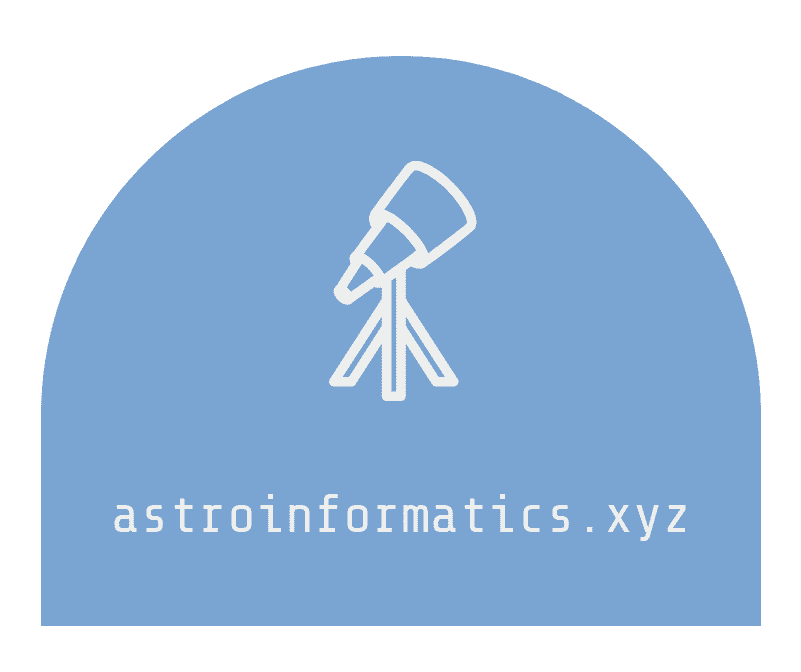
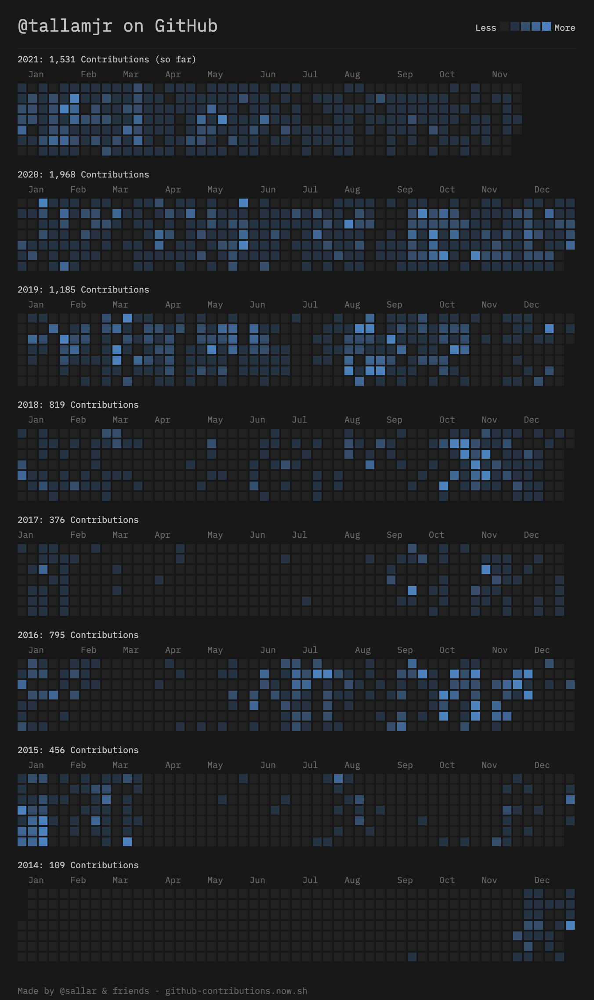

# Recent Projects

Below is a collection of open-source personal projects I am working on, as well as some very interesting projects I am lucky enough to be involved with. If you like the work here and would like to support more me, you can help sponsor more contributions
<a class="mdx-insiders" href="https://github.com/sponsors/tallamjr" data-icon="octicon-heart" aria-label="Sponsor @tallamjr on GitHub">here :octicons-heart-fill-24:{ .heart }</a>

---

##### [simurgh](https://github.com/alan-turing-institute/simurgh)

`simurgh` (pronounced Seymour) is an open source platform that supports developing and evaluating
algorithms (AI agents) for automated air traffic control. It provides an easy to use interface for
running experiments in an air traffic simulator as well as packages that support agent development.

Air traffic control (ATC) is a complex task requiring real-time safety-critical decision making. In
practice, air traffic control operators (ATCOs) monitor a given sector and issue commands to
aircraft pilots to ensure safe separation between aircraft. They also have to consider the number
and frequency of instructions issued, fuel efficiency and orderly handover between sectors.
Optimising for the multiple objectives while accounting for uncertainty (e.g., due to aircraft mass,
pilot behaviour or weather conditions) makes this a particularly complex task.

The Simurgh project provides a research-focused user-friendly platform for testing automated
approaches to ATC

---

##### www.astroinformatics.xyz

{ width=400 }

`astroinformatics.xyz` is a online book inspired by the OpenAI book
[SpinningUp](http://www.astroinformatics.xyz/etc/www.openai.com). The idea is to have a resource
that outlines the mathematics and technology involved with doing
[Astroinformatics](https://en.wikipedia.org/wiki/Astroinformatics) and the Mathematics and Data
Science that underpins the research. It is still very much a work in progress, but the plan is to
have 3 main sections:
1. **Data Science** for the Mathematics and Machine Learning theory.
2. **Data Engineering**; to showcase the technologies used, like Apache Spark or Apache Kafka for instance.
3. **Research Engineering** to outline the tools of the trade for reproducible research, model deployment and
production system design.

<!-- <embed src="http://www.astroinformatics.xyz" width="675" height="400" /> -->

---

##### [option3](https://github.com/tallamjr/option3)

{ width=400 }

`option3` is a proof of concept application that is being used to improve my understanding of
Kafka and Spark for developing machine learning data pipelines. Inspired by Stephane Maarek's [Kafka
for Beginners](https://www.linkedin.com/learning/learn-apache-kafka-for-beginners) course, I hope to
connect to the Twitter stream of tweets, apply some filtering and transformations, and finally
visualise, in real-time, the processed data.

 

---

Follow me on [Github](https://www.github.com/tallamjr/) and check out more of my projects.

{ width=800 }

<!--  -->

 
